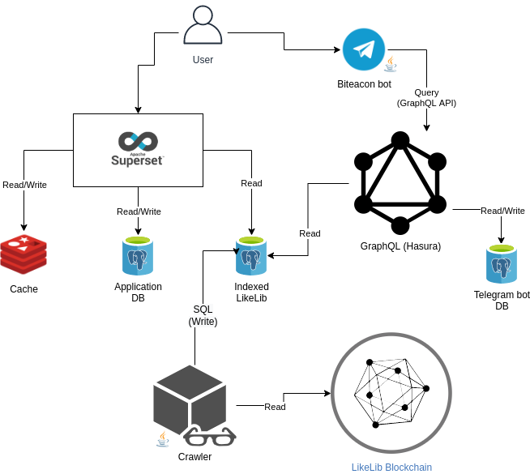
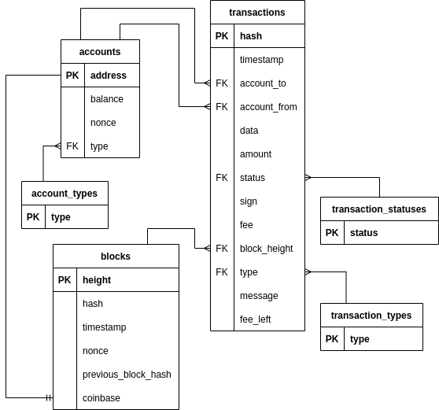

# UTON-HACK-2.0

## Architecture

## Indexed LikeLib schema

## Telegram-bot schema

## Installation and Configuration
`Почти все компоненты нашего решения используют Docker. Следуя инструкциям в каждом отдельном репозитории, вы можете 
быстро и легко развернуть рабочий стенд.`

`P.s. Перед запуском настоятельно рекомендуется поменять пароли!`
## Repositories
#### Актуальные
* [biteacon/UTON-HACK-2.0](https://github.com/biteacon/UTON-HACK-2.0) - репозиторий корневой документации по проекту Biteacon
* [biteacon/telegram-bot](https://github.com/biteacon/telegram-bot) - исходный код телеграм бота(эксплорер LikeLib), написанного на java
* [biteacon/postgres-hasura](https://github.com/biteacon/postgres-hasura) - исходный код конфигурации базы данных Postgres и 
Hasura GraphQL сервера, содержит миграции
* [biteacon/incubator-superset](https://github.com/biteacon/incubator-superset) - (Fork) Apache Superset (incubating) is a 
modern, enterprise-ready business intelligence web application
* [biteacon/crawler-likelib](https://github.com/biteacon/crawler-likelib) - кроулер, выкачивающий все данные из блокчейна LikeLib 
с хранением данных в key-value базе данных по http. Преобразует полученные данные и записывает в реляционную схему(postgres-hasura)
#### Устаревшие
`За время проведения хакатона пришлось изменить стратегию и архитектуру проекта. Мы пришли к выводу, что демонстрация
распределенных JOIN'ов из нескольких разных базах данных, с использованием Presto, потребует большей подготовки. 
Сложность оказалась в Superset, поскольку его компонент SQLAlchemy не поддерживает распределенный JOIN разных баз данных.`

`P.s. Вы все же можете использовать нашу готовую конфигурацию, чтобы увидеть распределенные запросы. Вы можете поднять
 в докере базу данных(postgres-hasura), а потом запустить в докере presto-server. После этого можно 
 подключиться через presto-cli и отправлять распределенные запросы.`
* [biteacon/presto-server](https://github.com/biteacon/presto-server) - сконфигурированный однонодовый сервер распределенного 
кластера запросов
* [biteacon/presto-cli](https://github.com/biteacon/presto-cli) - клиент для подключения к ноде кластера